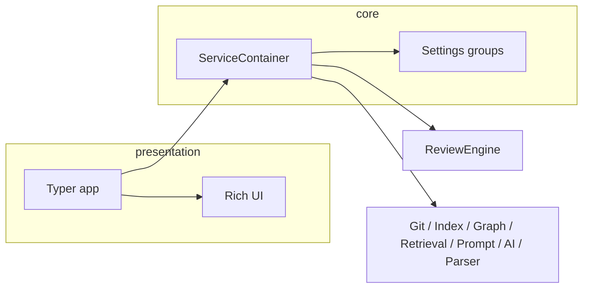
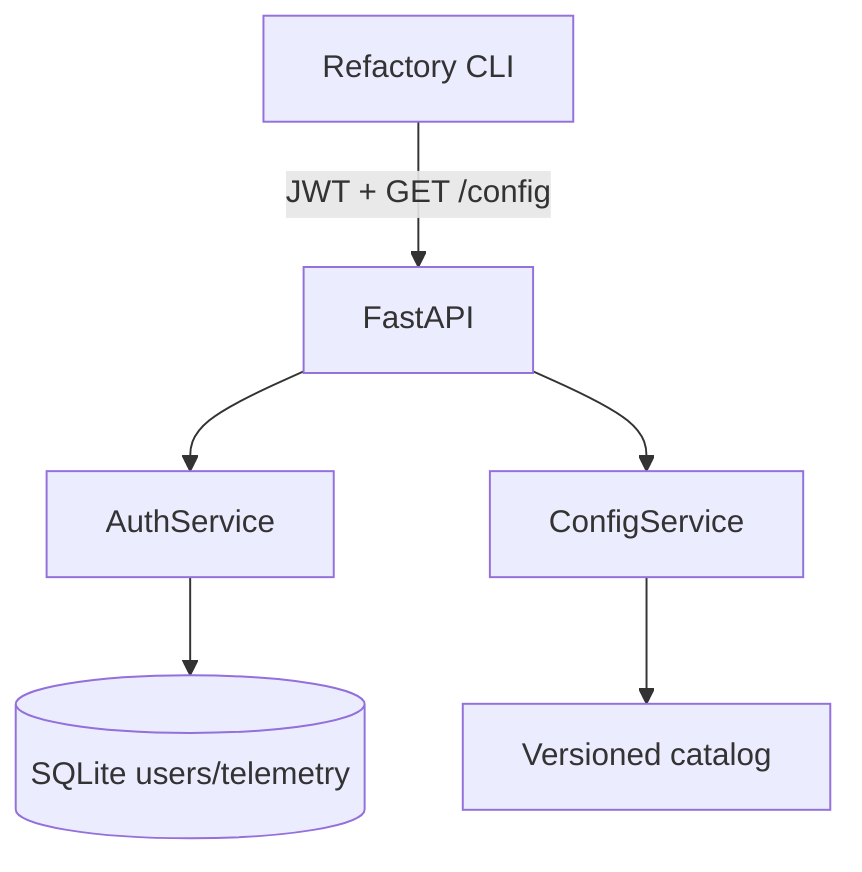
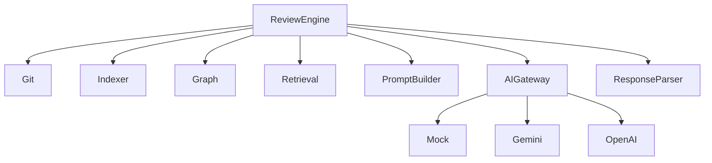

# Component Diagrams

## CLI process

```mermaid
flowchart LR
  subgraph presentation
    Typer[Typer app]
    Rich[Rich UI]
  end
  subgraph core
    Settings[Settings groups]
    DI[ServiceContainer]
  end
  Typer --> DI
  Typer --> Rich
  DI --> Settings
  DI --> Engine[ReviewEngine]
  DI --> Services[Git / Index / Graph / Retrieval / Prompt / AI / Parser]
```

## Control plane

```mermaid
flowchart TB
  CLI[Refactory CLI] -->|JWT + GET /config| API[FastAPI]
  API --> Auth[AuthService]
  API --> Cfg[ConfigService]
  Cfg --> Catalog[Versioned catalog]
  Auth --> DB[(SQLite users/telemetry)]
```

No repository source code crosses the CLI ↔ backend boundary.

## Review domain

```mermaid
flowchart TB
  Engine[ReviewEngine] --> Git
  Engine --> Indexer
  Engine --> Graph
  Engine --> Retrieval
  Engine --> PromptBuilder
  Engine --> AIGateway
  Engine --> ResponseParser
  AIGateway --> Mock
  AIGateway --> Gemini
  AIGateway --> OpenAI
```
